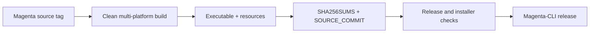

# Magenta CLI

<p align="center">
  <strong>Verified standalone binaries for Magenta</strong><br>
  <sub>无需 Node.js 或包管理器即可运行的编程与科研 Agent CLI。</sub>
</p>

<p align="center">
  <a href="https://github.com/Minions-Land/Magenta-CLI/releases/latest"></a>
  <a href="https://github.com/Minions-Land/Magenta-CLI/releases"></a>
  <a href="https://github.com/Minions-Land/Magenta-CLI/actions"></a>
  <a href="https://github.com/Minions-Land/Magenta"></a>
</p>

<p align="center">
  <a href="#installation">Installation</a> ·
  <a href="#update">Update</a> ·
  <a href="#verification-model">Verification</a> ·
  <a href="#supported-platforms">Platforms</a> ·
  <a href="#troubleshooting">Troubleshooting</a>
</p>

Magenta-CLI is the public distribution repository for [Magenta](https://github.com/Minions-Land/Magenta). Each release contains a platform executable, the matching runtime resources, and a `SHA256SUMS` manifest. The source repository and this distribution repository have separate responsibilities: Magenta builds the product; Magenta-CLI publishes and verifies the installable payload.

> [!IMPORTANT]
> Install the executable **and** `magenta-resources-universal.tar.gz` from the same release. The installer binds both to one exact tag and verifies `SHA256SUMS` before activation.

## Installation

### macOS and Linux

The release-bound bootstrap resolves one exact release tag, verifies the installer digest, and then runs the version-matched installer:

```bash
bootstrap="$(mktemp)"
curl -fsSL https://raw.githubusercontent.com/Minions-Land/Magenta-CLI/main/install.sh -o "$bootstrap"
bash "$bootstrap"
rm -f "$bootstrap"
```

The default user installation is:

```text
~/.local/lib/magenta/<managed release>
~/.local/bin/magenta -> <managed release>/magenta
```

Start Magenta from the project you want to work on:

```bash
cd /path/to/project
magenta
```

### Windows x64

PowerShell users can download the release-bound installer and pass the exact tag selected by the GitHub API:

```powershell
$ErrorActionPreference = "Stop"
$repo = "Minions-Land/Magenta-CLI"
$release = Invoke-RestMethod "https://api.github.com/repos/$repo/releases/latest"
$tag = [string]$release.tag_name
if ($tag -cnotmatch '^v(0|[1-9]\d*)\.(0|[1-9]\d*)\.(0|[1-9]\d*)$') { throw "Invalid release tag: $tag" }
$assets = @($release.assets | Where-Object { $_.name -ceq "install.ps1" })
if ($assets.Count -ne 1 -or $assets[0].state -cne "uploaded") { throw "Release has no unique installer" }
$asset = $assets[0]
if ([int64]$asset.size -le 0 -or [int64]$asset.size -gt 16MB) { throw "Installer size is invalid" }
if ([string]$asset.digest -cnotmatch '^sha256:(?<hash>[0-9a-f]{64})$') { throw "Installer digest is invalid" }
$expectedHash = $Matches.hash
$installer = Join-Path ([IO.Path]::GetTempPath()) ("magenta-install-" + [guid]::NewGuid() + ".ps1")
try {
  Invoke-WebRequest -UseBasicParsing "https://github.com/$repo/releases/download/$tag/install.ps1" -OutFile $installer
  if ((Get-Item -LiteralPath $installer).Length -ne [int64]$asset.size) { throw "Installer size mismatch" }
  if ((Get-FileHash -LiteralPath $installer -Algorithm SHA256).Hash.ToLowerInvariant() -cne $expectedHash) { throw "Installer digest mismatch" }
  & $installer -Version $tag
} finally {
  Remove-Item -LiteralPath $installer -Force -ErrorAction SilentlyContinue
}
```

The signed release workflow performs the authoritative installer size and SHA-256 checks before publication. The PowerShell installer stages the candidate, verifies the matching resources, starts it, and only then replaces the active entry point.

### Restricted or slow networks

Use a payload mirror only when GitHub's large release assets are slow. The mirror does not replace the integrity boundary:

```bash
export MAGENTA_GITHUB_MIRROR=https://ghfast.top
# Then run the normal bootstrap or: magenta update self
```

```powershell
$env:MAGENTA_GITHUB_MIRROR = "https://ghfast.top"
```

The mirror is used for the executable and resource archive only. Release metadata, the exact version, `SOURCE_COMMIT`, and `SHA256SUMS` remain tied to GitHub. If `api.github.com` is unreachable, fix that network path first; a payload mirror cannot provide trustworthy version resolution by itself.

## Update

Preferred command:

```bash
magenta update self
```

`magenta --update` remains a compatibility alias. A TTY shows the asset, progress, and retry attempt; non-TTY runs stay quiet. The updater preserves the managed installation layout and user data such as settings, credentials, Sessions, and messages.

## How a release is assembled



A release is considered usable only after the platform executable, resources archive, checksum manifest, and `SOURCE_COMMIT` receipt agree. A single binary without its matching resources is incomplete.

## Verification model

- The release workflow builds from an immutable Magenta source tag.
- The exact nine-asset set is checked before publication.
- The executable and resources are checked against `SHA256SUMS`.
- Installers verify the candidate before changing the active entry point.
- macOS and Linux startup checks exercise the packaged CLI; platform jobs also check architecture and materialized runtime helpers.
- Public users can inspect `SOURCE_COMMIT` and the checksum manifest on every release.

Apple Developer ID signing and notarization are outside the current release contract. On macOS, Gatekeeper may require Finder's **Open** action or an explicit confirmation in **Privacy & Security**.

<details>
<summary>Manual download and checksum verification</summary>

Choose one exact tag and download the platform executable, resources archive, and manifest from that same tag:

```bash
tag="<exact-release-tag>"
base="https://github.com/Minions-Land/Magenta-CLI/releases/download/$tag"
asset="magenta-linux-x64" # or magenta-macos-arm64, magenta-macos-x64, or magenta-windows-x64.exe
curl -fL "$base/$asset" -o "$asset"
curl -fL "$base/magenta-resources-universal.tar.gz" -o magenta-resources-universal.tar.gz
curl -fL "$base/SHA256SUMS" -o SHA256SUMS
awk -v target="$asset" '$2 == target || $2 == "magenta-resources-universal.tar.gz"' SHA256SUMS > SHA256SUMS.selected
test "$(wc -l < SHA256SUMS.selected | tr -d " ")" = 2
if command -v sha256sum >/dev/null 2>&1; then
  sha256sum -c SHA256SUMS.selected
else
  shasum -a 256 -c SHA256SUMS.selected
fi
```

This verifies files from one release; it does not install them or replace an existing entry point.
</details>

## Supported platforms

| Platform | Asset |
|---|---|
| macOS Apple Silicon | `magenta-macos-arm64` |
| macOS Intel | `magenta-macos-x64` |
| Linux x64 | `magenta-linux-x64` |
| Windows x64 | `magenta-windows-x64.exe` |

## Troubleshooting

| Symptom | Check |
|---|---|
| `Could not fetch latest release` | Confirm access to `api.github.com`; payload mirrors do not proxy release metadata. |
| Download is slow | Set `MAGENTA_GITHUB_MIRROR` for the payload and rerun the installer or `magenta update self`. |
| HTTP 403 from GitHub API | Check the API rate-limit reset time; public releases do not require a token. |
| `--update` is unavailable | Reinstall with the release-bound bootstrap; very old releases predate the current split-asset layout. |
| Startup fails after a partial install | Re-run the installer for the exact release; it verifies and stages before activation. |

For product behavior, HCP contracts, Tools, Hooks, Sessions, and development instructions, use the [Magenta source documentation](https://github.com/Minions-Land/Magenta#documentation).

## Maintainers

Release publication is tag-driven from the Magenta source repository. Read its [release guide](https://github.com/Minions-Land/Magenta/blob/main/docs/UPDATE_SETUP_GUIDE.md) before running release commands. Do not upload ad-hoc local binaries as a substitute for the verified workflow.
